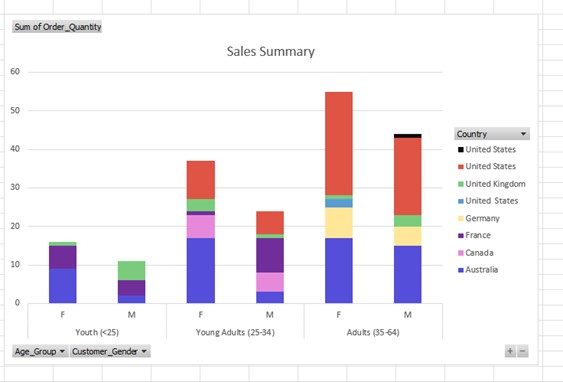
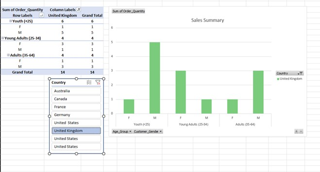

# Excel Training - Week 1 Summary

During the first week of my Excel training, I focused on three key areas:

*   Cleaning data
*   Mastering Excel functions
*   Leveraging pivot tables alongside chart visualisations

## Excel Functions

I learned how to aggregate functions to derive new insights and generate additional data columns from existing datasets. For example, using a student grades dataset, I created two new columns—one for the average grade and another for the highest score—providing a deeper analysis of each student's performance.

Working with a retail sales dataset, I practiced calculating averages, filtering data, and identifying maximum and minimum values. This allowed me to explore and apply a variety of Excel functions and conditional formatting techniques effectively.

## Data Cleaning and Visualisation

A significant component of the training was data cleaning. I imported multiple CSV files into both Power Query and Excel to edit and clean the data for visualisation purposes.

For instance, with a dataset called "Bike Sales," I cleaned and organised the data, created a pivot table, and developed several visualisations including pie charts, column charts, and line graphs.

I also integrated slicers for dynamic data filtering. This analysis enabled me to answer critical questions such as, "What country has sales in all markets?". The insights derived from these efforts have the potential to support strategic business growth.

## Presentation to Board of Directors

Lastly, I was tasked with delivering my findings to the board of directors. I explained how I would utilise a comprehensive dashboard, filled with various charts and visualisations, to highlight the key priorities and concerns of the audience. With these insights, I would be well equipped to recommend future strategies and improvements for the business.
