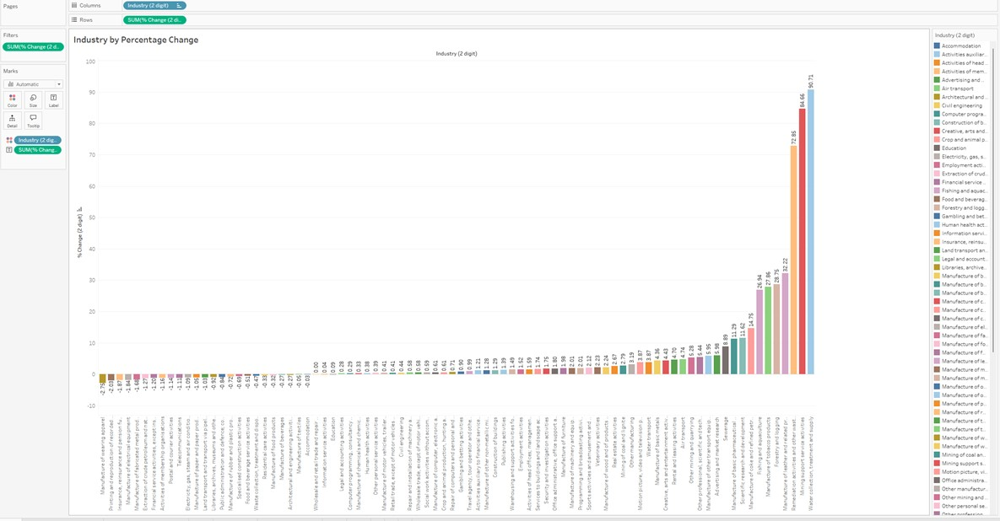
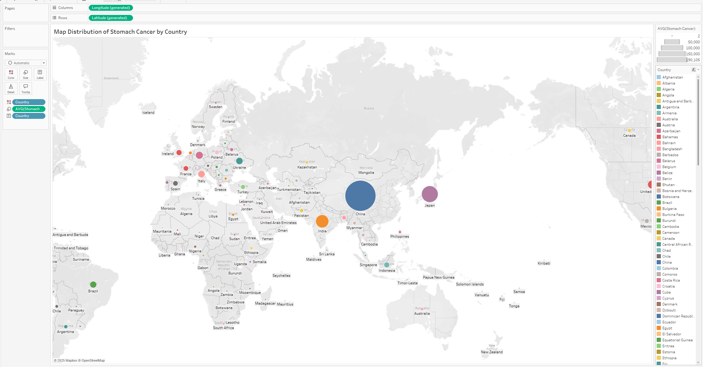
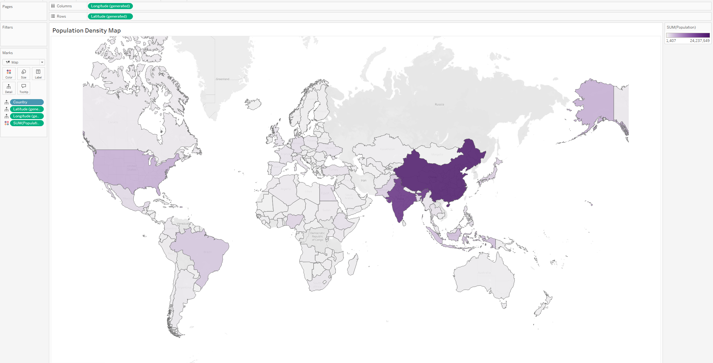

# Week 2 Data Visualisation - Tableau and Power BI

In week two, we shifted our focus to data visualisation, diving into both Tableau and Power BI. I learned how to connect to various data sources and create interactive dashboards that effectively communicate key insights. By designing intuitive visualizations and utilising dynamic features like filters, I gained a deeper understanding of how to transform raw data into compelling, actionable insights for informed decision-making.

## Tableau

I began by researching and comparing the various Tableau products—Tableau Desktop, Tableau Server, Tableau Prep, Tableau Cloud, and Tableau Public—to understand their unique capabilities. Next, I utilised a dataset called “EMSI_JobChange_UK” to create a series of visualisations in Tableau, ultimately building a comprehensive dashboard that summarized the insights and findings from the data.

I used a Spotify dataset to explore a diverse range of charts and maps that Tableau offers, experimenting with various chart types to uncover key insights. 

Additionally, I worked with a healthcare dataset to create maps including density maps that visualised cancer rates across different countries, providing a clear geographic context. These visualisations, along with others, highlight the breadth of my analytical approach and demonstrate my ability to creatively leverage Tableau's features for impactful data exploration and presentation.

## Power BI

Following my work in Tableau, I completed several Power BI labs. The first lab focused on importing data into Power BI Desktop, while the second demonstrated how to load transformed data. In the seventh lab, I designed a detailed report in Power BI Desktop, which culminated in the creation of an interactive dashboard.

Overall, this experience enhanced my ability to visualise data effectively, leveraging both Tableau and Power BI to derive meaningful insights and present them in an engaging, accessible format.
