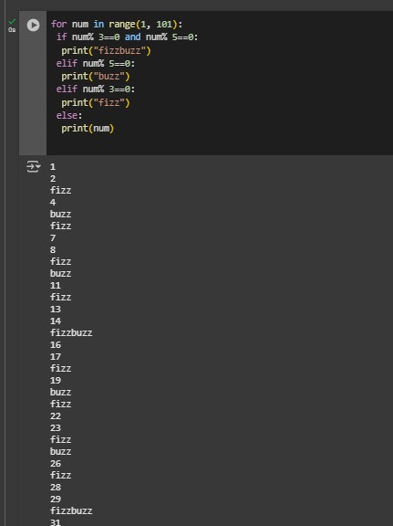
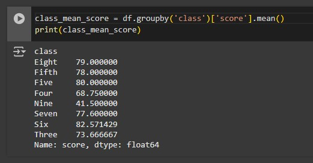
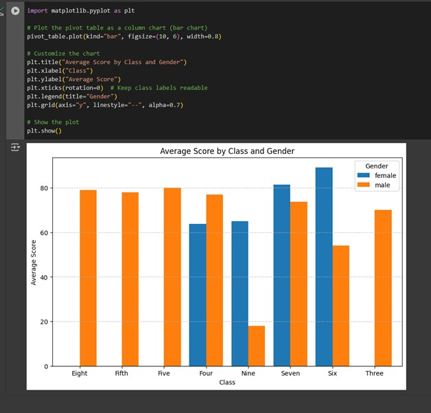

# Week 6 – Python

In Week 6, I learned Python programming, focusing on key concepts such as data types, control structures, and functions. I also gained hands-on experience applying Python to solve real-world problems and analyse datasets efficiently.

## Exercise 1 – Loading and Exploring

In the Loading and Exploring phase, I imported datasets into Python using Pandas, allowing me to inspect the data's structure, identify any missing values, and gain initial insights into potential patterns and trends.

## Exercise 2 – Indexing and Slicing

In Exercise 2, I mastered indexing and slicing in Python. I learned how to use indexing to access individual elements within data structures like lists, strings, and tuples, using both positive and negative indices. 

## Exercise 3, 4 – Data Manipulation, Aggregation, and Grouping

In Exercise 3, we focused on data manipulation techniques using Pandas, learning how to clean, transform, and reshape data to make it more useful for analysis. I practiced tasks such as filtering data, handling missing values, merging datasets, grouping data, and applying functions to modify or aggregate data, providing me with key skills for preparing data for deeper exploration and visualisation.

## Exercise 5 – Advanced Operations

In week 5 I learned how to manipulate data using pandas, including creating pivot tables for better data comparison, applying conditional logic to categorise values, and sorting data for quick insights. These skills help in organising and analysing large datasets efficiently.

## Exercise 6 – Exporting Data

I learned how to save a pandas DataFrame into different formats like CSV, Excel, and JSON, making data easy to store, share, and use in various applications.

## Exercise 7 – Visualisation

I learned how to visualize data in Python using the matplotlib library, which allows for creating various charts like line graphs, bar charts, and scatter plots.

## Summary

Learning Python has helped me develop skills in data manipulation, visualisation, and automation. I gained experience using libraries like pandas for handling datasets, matplotlib for visualising trends, and writing efficient code for problem-solving. Python's simplicity and versatility make it a powerful tool for data analysis and various applications.
